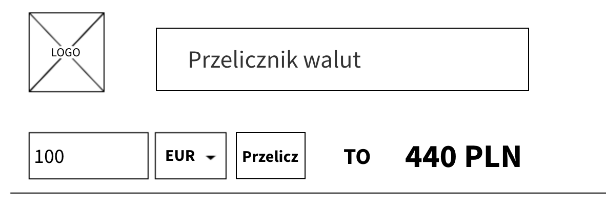
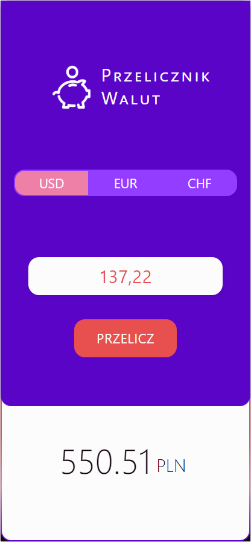
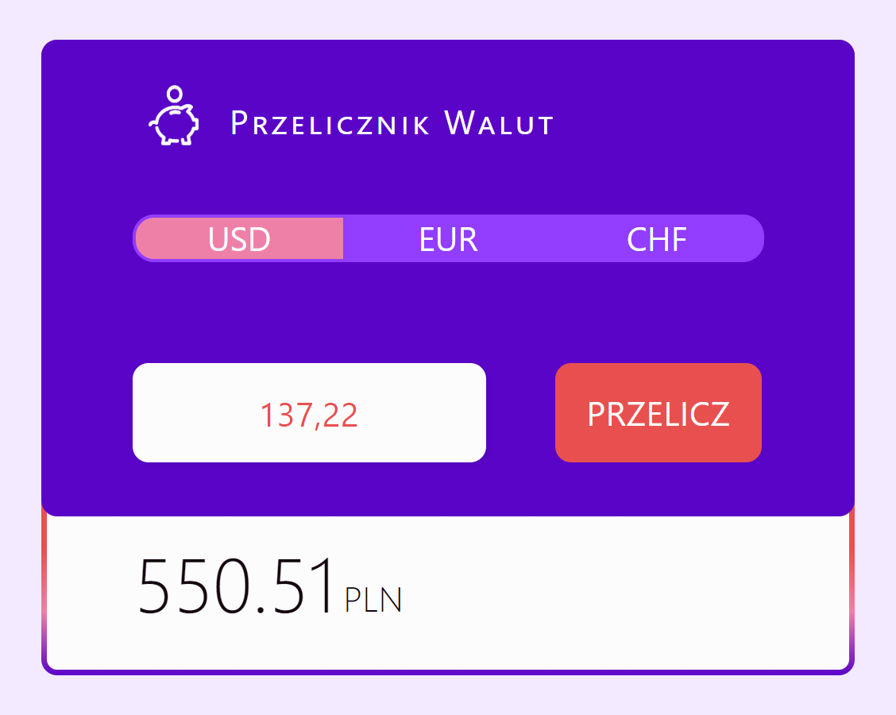

Using the free API from the NBP website (https://api.nbp.pl/?ref=public-apis), a simple currency converter should be created that takes into account the following currencies: euros, US dollars, and Swiss francs. The application should allow for the conversion of the selected currency into Polish zloty. The exchange rate for the given currency should be taken as the latest one (from the current day).

This is how the example interface looks like:

And this is my design:

Responsive website for performing simple currency conversions from USD, EUR, and CHF to PLN, featuring vibrant, intense colors and based on Bootstrap. Created for a project assignment at Future Collars bootcamp.

Check out the project:  
 [Figma](https://www.figma.com/design/0Is0CwhtAsAHodW0j7sdsi/Currency-Converter?t=hYJLrlm7cOHsGM7x-1) 
 [Netlify](https://to-pln-currency-converter.netlify.app/)
